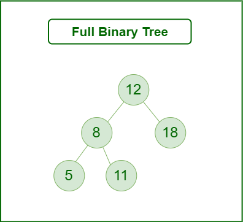

## What is a Tree?
- A Tree is a non-linear data structure and herarchy consisting of a collection of nodes such that each node of the tree stores a value and list of references to other nodes.

## Types of Tree in Data structure bases on the number of children:

## 1.Binary Tree

A binary Tree is defind as a Tree data structure with at most 2 children. Since each element in a binary tree can have only 2 children, we typically name them the left and right child.

## Types of Binary Tree based on the number of children:

1. Full Binary Tree
2. Degenrate Binary Tree
3. Skewed Binary Trees

### 1.Full Binary Tree

 A Binary Tree is a full binary tree if every node has 0 or 2 children. The following are examples of a full binary tree. We can also say a full binary tree is a binary tree in which all nodes except leaf nodes have two children. 

 

 ### 2.  Degenerate (or pathological) tree

 A Tree where every internal node has one child. Such trees are performance-wise same as linked list. A degenerate or pathological tree is a tree having a single child either left or right.

### 3.Skewed Binary Tree

A skewed binary tree is a pathological/degenerate tree in which the tree is either dominated by the left nodes or the right nodes. Thus, there are two types of skewed binary tree: left-skewed binary tree and right-skewed binary tree.

## Types of Binary Tree On the basis of the completion of levels:

1. Complete Binary Tree
2. Perfect Binary Tree
3. Balanced Binary Tree

### 1. Complete Binary Tree

A Binary Tree is a Complete Binary Tree if all the levels are completely filled except possibly the last level and the last level has all keys as left as possible.

A complete binary tree is just like a full binary tree, but with two major differences:

* Every level except the last level must be completely filled.
* All the leaf elements must lean towards the left.
* The last leaf element might not have a right sibling i.e. a complete binary tree doesn’t have to be a full binary tree.

### 2. Perfect Binary Tree
A Binary tree is a Perfect Binary Tree in which all the internal nodes have two children and all leaf nodes are at the same level. 

### 3. Balanced Binary Tree

A binary tree is balanced if the height of the tree is O(Log n) where n is the number of nodes.

## Some Special Types of Trees:

* Binary Search Tree
* AVL Tree
* Red Black Tree
* B Tree
* B+ Tree
* Segment Tree

### 1. Binary Search Tree

Binary Search Tree is a node-based binary tree data structure that has the following properties:

* The left subtree of a node contains only nodes with keys lesser than the node’s key.
* The right subtree of a node contains only nodes with keys greater than the node’s key.
* The left and right subtree each must also be a binary search tree.

### 2. AVL Tree

AVL tree is a self-balancing Binary Search Tree (BST) where the difference between heights of left and right subtrees cannot be more than one for all nodes.

#### Example of AVL Tree shown below:

The below tree is AVL because the differences between the heights of left and right subtrees for every node are less than or equal to 1

### 3. Red Black Tree

A red-black tree is a kind of self-balancing binary search tree where each node has an extra bit, and that bit is often interpreted as the color (red or black). These colors are used to ensure that the tree remains balanced during insertions and deletions. 

### 4. B-Tree

A B-tree is a type of self-balancing tree data structure that allows efficient access, insertion, and deletion of data items. B-trees are commonly used in databases and file systems, where they can efficiently store and retrieve large amounts of data. A B-tree is characterized by a fixed maximum degree (or order), which determines the maximum number of child nodes that a parent node can have. Each node in a B-tree can have multiple child nodes and multiple keys, and the keys are used to index and locate data items.

### 5. B+ Tree

A B+ tree is a variation of the B-tree that is optimized for use in file systems and databases. Like a B-tree, a B+ tree also has a fixed maximum degree and allows efficient access, insertion, and deletion of data items. However, in a B+ tree, all data items are stored in the leaf nodes, while the internal nodes only contain keys for indexing and locating the data items. This design allows for faster searches and sequential access of the data items, as all the leaf nodes are linked together in a linked list.

### 6. Segment Tree

Segment Tree, also known as a statistic tree, is a tree data structure used for storing information about intervals, or segments. It allows querying which of the stored segments contain a given point. It is, in principle, a static structure; that is, it’s a structure that cannot be modified once it’s built. A similar data structure is the interval tree.

